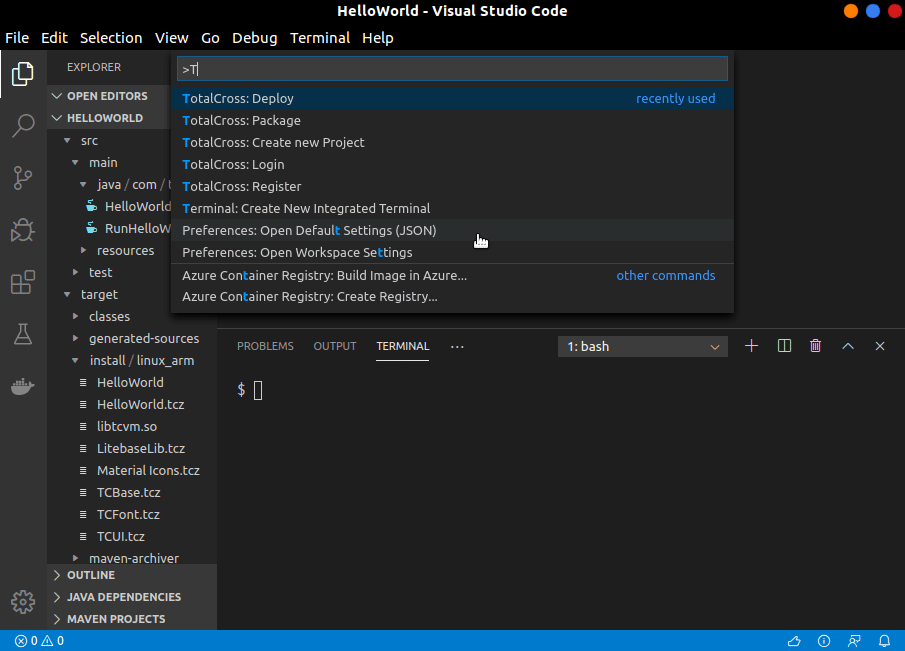

 

 
<h1>TotalCross Plugin</h1> 

The simplest way to start coding with TotalCross</strong></em>

TotalCross Plugin for VSCode is a tool that allows people coding with TotalCross to jump in the coding part without needing to set up their own TC Virtual Machine and project folder structure. It sorts it all for you!

## Features

- Create a new project;
- Package;
- Deploy;
- Deploy&Run (-linux_arm only via SSH).

## Requirements

- Java JDK 1.8 | [offical](https://www.oracle.com/technetwork/java/javase/downloads/jdk8-downloads-2133151.html) | [azul openjdk](https://www.azul.com/downloads/zulu-community/?&version=java-8-lts&architecture=x86-64-bit&package=jdk) |
- Maven 3.6.2 | [download](https://maven.apache.org/download.cgi) | [how to install](https://maven.apache.org/install.html) |
- Microsoft Java Extension Plugin for vscode | [home](https://marketplace.visualstudio.com/items?itemName=vscjava.vscode-java-pack) |

## Using TotalCross Plugin

### Create a project

This is the first step you will need to follow.

- Press `F1` or `cmd + shift + p` and search for `Totalcross: Create new Project`.

Now you can start coding your project.

### Package

Once your project is finished, it's time to package it. This is how you do it:

- Press `F1` or `cmd + shift + p` and search for `Totalcross: Package`;
- The target program will take place inside the folder `target/install/<platform>`.

### Deploy

- Press `F1` or `cmd + shift + p` and search for `Totalcross: Deploy`;
- Fill in the device information.
- See the result on the screen or with VNC.

### Deploy and Run

This is working only for linux arm programs. This feature performs platform _deploy&run_ via ssh.

- Press `F1` or `cmd + shift + p` and search for `Totalcross: Deploy&Run`.

## Contributing to TotalCross Plugin

To contribute, follow these steps:

1. Fork this repository.
2. Create a branch: `git checkout -b <branch_name>`.
3. Make your changes and commit them: `git commit -m '<commit_message>'`
4. Push to the original branch: `git push origin <project_name>/<location>`
5. Create the pull request.

## Contributors

Thanks to the following people who have contributed to this project:

- [@ItaloYeltsin](https://github.com/ItaloYeltsin) 💻
- [@acmlira](https://github.com/acmlira) 💻
- [@nmarquesin](https://github.com/nmarquesin) 📖

## Contact

If you want to contact me you can reach me at br.yeltsin@gmail.com.

## License

This project uses the following license: [MIT](LICENSE).
